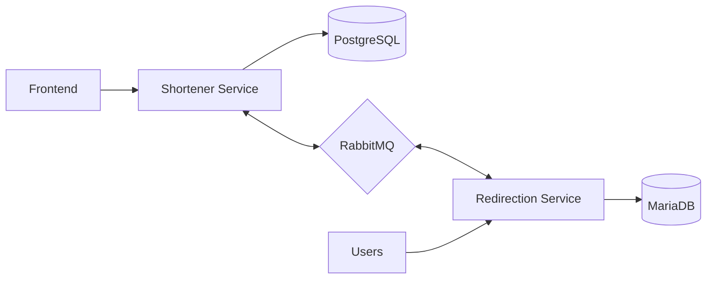

# URL Shrtnr

A microservices-based URL shortening service built with Go and Node.js. This project demonstrates the implementation of distributed systems using multiple services that communicate through message queues.

## Architecture

The project consists of three main components:

### 1. Frontend Service

- Vanilla JavaScript, HTML, and CSS
- Bundled with Webpack
- Clean, minimalist interface
- Handles URLs up to 400 characters

### 2. Shortener Service (Go)

- Written in Go
- PostgreSQL database
- Handles URL shortening logic
- Communicates with Redirection service via RabbitMQ
- RESTful API endpoints

### 3. Redirection Service (Node.js)

- Written in Node.js
- MariaDB database
- Handles URL redirection
- Syncs with Shortener service via RabbitMQ

## System Design

## Technical Stack

### Frontend

- HTML5
- CSS3
- Vanilla JavaScript
- Webpack for bundling and optimization

### Backend Services

#### Shortener Service

- Go
- PostgreSQL
- RabbitMQ for message queue

#### Redirection Service

- Node.js
- MariaDB
- RabbitMQ for message queue

### DevOps

- Docker support for containerization
- Environment-based configuration

## Project Status

This project was built as a learning exercise to demonstrate:

- Microservices architecture implementation
- Service communication using message queues
- Multiple database management
- Cross-service data synchronization
- Container orchestration

While currently not in active deployment, future plans include:

- Adding analytics
- Implementing an advertising system
- Performance optimizations
- Enhanced monitoring and logging

## License

[MIT License](LICENSE.md)

## Acknowledgments

- Built as a demonstration of full-stack development capabilities
- Showcases integration between Go and Node.js services
- Implements real-world microservices patterns

---
© 2024 rbennum. All rights reserved.
